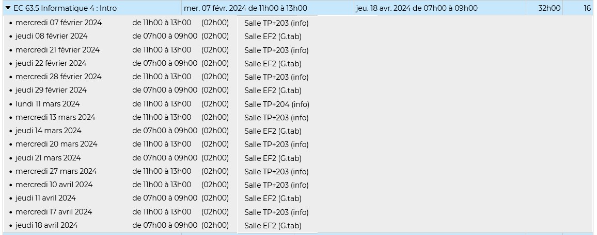

shoerley march2024

# Introduction à l'intelligence artificielle

## Plan du cours

## Planning des séances de CM et de TD
Le planning est repris ici à titre indicatif. Seules les mentions faites par voies d'affichage officielles font foi.

## Modalités de contrôle des connaissances
Tel que transmis par la responsable de la licence en date du 22 février 2024, la maquette prévoit deux notes pour cet enseignement : une note de TP et une note de CC, à effectuer au plus tard le 19 avril 2024. 
Ces notes pourront être la moyenne de plusieurs évaluations, par exemple la moyenne de plusieurs TP pour la note de TP.

### Contrôle Continu
- Date prévue:  le jeudi 18 avril 2024 de 7h15 à 9h (sur le créneau du dernier CM)
- Documents autorisés : une feuille A4 recto verso, manuscrite.
- Matériel autorisé : aucun (pas de calculatrice).

La note à cette épreuve sera la note de contrôle continu pour l'enseignement.

### Travaux Pratiques

Vous aurez deux notes de travaux pratiques.
- Note 1 : Remise du TD2 (date limite de remise: mer. 27 mars 2024 à 13h)
- Note 2 : Remise du TD3 (date limite de remise: mer. 11 avril 2024 à 13h)
- Note 3 : TP noté en séance le mer. 17 avril 2024 de 11h15 à 13h (sur le créneau du dernier TD)

La note à cette épreuve sera la moyenne des trois notes. La note 3 sera coefficientée 0.5, la note 2 sera coefficientée 0.3, la note 1 sera coefficientée 0.2

